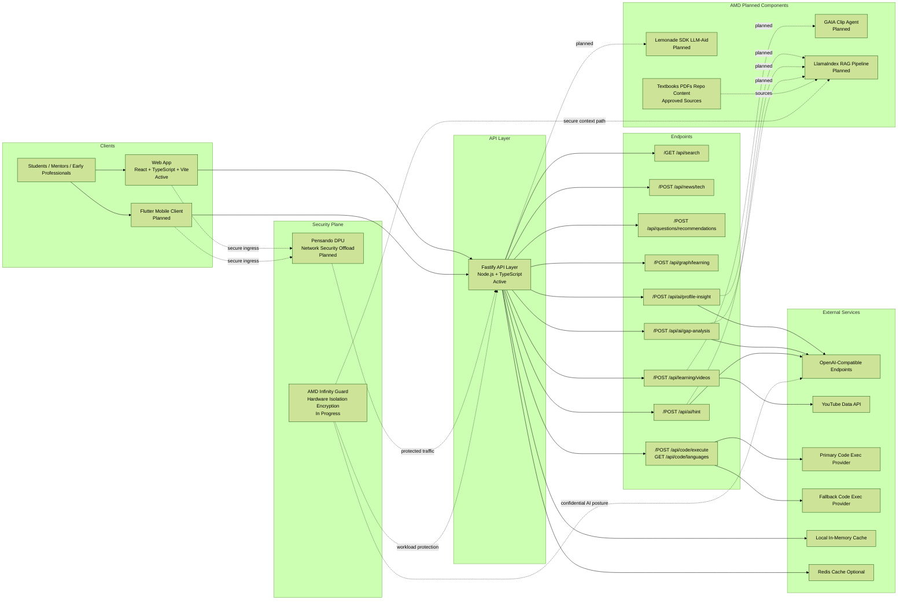

# Melete
AMD Slingshot 2026 - AI in Education and Skilling

Melete is our contest product for AMD Slingshot 2026. It is a private-by-default learning platform that combines adaptive coaching, coding practice, multimodal support, and low-code AI utility workflows.

## Table of Contents
1. [What Is Melete](#what-is-melete)
2. [Hackathon Context](#hackathon-context)
3. [AMD Integration](#amd-integration)
4. [Feature Set](#feature-set)
5. [Screens and Navigation](#screens-and-navigation)
6. [Metrics and KPIs](#metrics-and-kpis)
7. [Tech Stack](#tech-stack)
8. [Project Structure](#project-structure)
9. [Planned Add-Ons](#planned-add-ons)
10. [Environment and Configuration](#environment-and-configuration)
11. [Setup from Scratch](#setup-from-scratch)
12. [Running the App](#running-the-app)
13. [Build and Deployment](#build-and-deployment)
14. [API Surface](#api-surface)
15. [Repository Layout](#repository-layout)
16. [Credits](#credits)

## What Is Melete
Melete is designed for students, early professionals, and learning communities that need practical AI support without sacrificing privacy.

Primary user groups:
- College and university learners
- Developer club members and hackathon teams
- Faculty mentors and training coordinators
- Early-career professionals upskilling for technical roles

Core product intent:
- Turn curriculum and learning signals into daily action plans
- Provide grounded, hint-first AI coaching rather than generic answers
- Offer multi-language coding practice with execution feedback
- Keep sensitive content private and controlled by default

## Hackathon Context
Hackathon: AMD Slingshot 2026  
Product: Melete

### Challenge Alignment
| Priority | Challenge Area | How Melete Aligns |
| --- | --- | --- |
| Primary | AI in Education and Skilling | Adaptive missions, concept coaching, profile-aware guidance, and practice workflows |
| Primary | Future of Work and Productivity | Daily execution loops, skill tracking, and output-focused routines |
| Secondary | Responsible and Private AI | Local-first design posture, explicit data boundaries, and private-by-default principles |
| Secondary | Consumer AI Experience Quality | Simple UX for high-frequency use, transparent recommendations, and actionable insights |

## AMD Integration
Melete uses an AMD-aligned architecture blueprint for performance, privacy, and scalability.

| Component | Why It Fits | Role in Melete | Status |
| --- | --- | --- | --- |
| Lemonade SDK (LLM-Aid) | Enables low-code AI utility building with hardware abstraction | Planned routing of workloads across NPU, iGPU, and CPU | Planned |
| GAIA Clip Agent | Strong fit for video and multimodal workflows | Planned YouTube search, Q&A, and summary assistance | Planned |
| LlamaIndex-based RAG pipeline | Grounds responses in approved materials | Planned concept coach on textbook/PDF/repo indexes | Planned |
| AMD Infinity Guard | Supports private-by-default security posture | Hardware-backed isolation and encryption model for sensitive workloads | In progress |
| Pensando DPUs | Improves throughput and security at scale | Planned networking/security offload for high-concurrency campus usage | Planned |

Architecture diagram (editable draw.io):
- [docs/architecture.drawio](docs/architecture.drawio)

Architecture preview (Mermaid fallback):



## Feature Set
Implemented and active modules in this repository:

### Learning Platform
- Personalized dashboard with progress indicators and activity summaries
- Mission-oriented daily learning tasks
- Tracks, courses, and branch-aware discovery
- Ranked search with fuzzy and weighted relevance behavior

### Coding and Practice
- Multi-language code execution flow through backend execution providers
- Language templates and practice workflows
- Result/error handling for compilation/runtime outcomes
- Skill-building loop integrated into learner journey

### AI Coaching
- Login-time learner profile insight generation
- Gap analysis for failed attempts
- Hint-first assistance mode
- Personalized learning video recommendation pipeline

### Knowledge and Discovery
- Tech news feed generation APIs
- Learning knowledge-graph generation endpoint
- Question recommendation endpoint for practice focus

## Screens and Navigation
High-level route map from `src/App.tsx`:

```text
/
  |- /login
  |- /signup
  |- /dashboard
  |- /tracks
  |    |- /tracks/:trackId
  |         |- /tracks/:trackId/courses/:courseId
  |- /courses
  |- /practice
  |- /question-hub
  |- /hackathons
  |- /techvise
  |- /whats-up-in-tech
  |- /roadmaps
  |- /mission
  |- /profile
  |- /settings
  |- /knowledge-graph
  |- *
```

## Metrics and KPIs
Melete is measured as a product, not just a prototype.

### Product and Adoption
| Metric | Target |
| --- | --- |
| Weekly active learners | 1,000+ in pilot rollout |
| Time to first useful utility | Under 30 minutes |
| Utility completion rate | Over 70% |
| 30-day retention | Over 40% |

### Learning Outcomes
| Metric | Target |
| --- | --- |
| Course completion uplift | +20% against baseline |
| Concept mastery score | 80%+ average |
| Practice-to-pass ratio | 25% improvement |
| 7-day streak continuity | 50%+ of active learners |

### AI Quality and Reliability
| Metric | Target |
| --- | --- |
| Grounded response rate | 95%+ |
| Hallucination incidence | Under 3% |
| API success rate | 99.5%+ |
| P95 latency (non-execution APIs) | Under 800 ms |

### Privacy and Responsible AI
| Metric | Target |
| --- | --- |
| Sensitive workload local-processing coverage | 85%+ |
| Encryption coverage (at rest + in transit) | 100% |
| Policy violation rate | Under 1% |
| Critical control audit pass rate | 100% |

## Tech Stack
| Layer | Technology |
| --- | --- |
| Frontend | React 18, TypeScript, Vite, Tailwind, shadcn/ui |
| Mobile (Future) | Flutter (Android and iOS client planned) |
| State and Data | React Query, Context APIs |
| Backend | Fastify, TypeScript, Node.js |
| Search and Caching | Weighted search logic, local cache, optional Redis (`ioredis`) |
| AI and Integrations | OpenAI-compatible endpoints, YouTube Data API workflows |
| Developer Tooling | Vitest, ESLint, Docker Compose, Cloud Run deploy scripts |

## Project Structure
```text
learner-compass/
  src/                      # Frontend app
  server/                   # Fastify backend APIs
  backend/                  # Supporting backend utilities
  deploy/                   # Deployment scripts
  docker/                   # Container resources
  public/                   # Static assets
  package.json              # Scripts and dependencies
  docker-compose.yml        # Local multi-service run
  Dockerfile.backend        # Backend container image
  Dockerfile.frontend       # Frontend container image
```

## Planned Add-Ons
These modules are intentional roadmap items for contest and post-contest evolution.

| Module | Purpose | Status |
| --- | --- | --- |
| Flutter Mobile App | Cross-platform Melete client for Android and iOS with learner dashboards, missions, and AI assistant access | Planned (Future) |
| Personal LLM Workspace | User-level memory, private context windows, personalized assistant behavior | Planned |
| Gmail Connector | Turn email threads into tasks, priorities, and revision reminders | Planned |
| WhatsApp Connector | Extract action items from groups and create daily plan cards | Planned |
| Calendar Connector | Auto-schedule missions, deadlines, and focus sessions | Planned |
| Drive and Docs Connector | Ground tutoring and summaries on user-owned docs | Planned |
| LMS Connector | Sync assignments, submissions, and rubric checkpoints | Planned |
| Mentor Copilot | Cohort-level risk and progress signals for faculty/mentors | Planned |
| Research Assistant | Literature summaries, citations, and concept maps | Planned |

Recommended future module layout:

```text
learner-compass/
  agents/
    personal-llm/
    concept-coach/
    gaia-clip/
  connectors/
    gmail/
    whatsapp/
    calendar/
    drive/
    lms/
  rag/
    indexing/
    retrieval/
    guardrails/
  observability/
    metrics/
    tracing/
```

## Environment and Configuration
Core backend/runtime variables:
- `PORT`, `HOST`
- `MAX_SEARCH_RESULTS`, `SEARCH_CACHE_TTL_MS`, `SEARCH_CACHE_MAX_ENTRIES`
- `REQUEST_TIMEOUT_MS`, `KEEP_ALIVE_TIMEOUT_MS`, `RATE_LIMIT_MAX_PER_MINUTE`
- `REDIS_URL`, `SEARCH_CACHE_REDIS_KEY_PREFIX`

Code execution variables:
- `CODE_EXEC_PROVIDER`, `CODE_EXEC_API_URL`, `CODE_EXEC_API_KEY`, `CODE_EXEC_API_HOST`
- `CODE_EXEC_FALLBACK_PROVIDER`, `CODE_EXEC_FALLBACK_API_URL`
- `CODE_EXEC_REQUEST_TIMEOUT_MS`, `CODE_EXEC_POLL_INTERVAL_MS`, `CODE_EXEC_POLL_ATTEMPTS`
- `CODE_EXEC_MAX_TEST_CASES`, `CODE_EXEC_MAX_SOURCE_CHARS`

AI and content variables:
- `OPENAI_API_KEY`, `OPENAI_API_URL`, `OPENAI_MODEL`
- `OPENAI_REQUEST_TIMEOUT_MS`, `OPENAI_MAX_CONTEXT_CHARS`
- `YOUTUBE_API_KEY`, `YOUTUBE_API_URL`, `YOUTUBE_DEFAULT_MAX_RESULTS`, `YOUTUBE_REQUEST_TIMEOUT_MS`
- `VITE_API_BASE_URL` (frontend API override)

Reference env files:
- `.env.backend.example`
- `.env.frontend.example`
- `.env.docker.example`
- `.env.docker`

## Setup from Scratch
Prerequisites:
- Node.js 18+
- npm
- Docker Desktop (optional, for container workflow)

Clone and install:

```bash
git clone <your-repo-url>
cd learner-compass
npm install
```

## Running the App
Start backend:

```bash
npm run server:dev
```

Start frontend in a second terminal:

```bash
npm run dev
```

Default local behavior:
- Frontend runs on Vite default port
- Backend runs on `PORT` (default `4000`)
- Vite proxies API paths to backend

## Build and Deployment
### Local validation
```bash
npm test
npm run build
```

### Docker workflow
```bash
npm run docker:up
npm run docker:logs
npm run docker:down
```

### Cloud Run deployment
```bash
PROJECT_ID=<your-project-id> REGION=us-central1 npm run deploy:gcp
```

### Vercel frontend deployment
Set:
- Build command: `npm run build`
- Output directory: `dist`
- Environment variable: `VITE_API_BASE_URL=<backend-url>`

## API Surface
Key backend endpoints:

Health and platform:
- `GET /healthz`
- `GET /readyz`
- `GET /metrics`

Search and discovery:
- `GET /api/search`
- `POST /api/news/tech`
- `POST /api/questions/recommendations`
- `POST /api/graph/learning`

Code execution:
- `GET /api/code/languages`
- `POST /api/code/execute`

AI and learning support:
- `POST /api/ai/profile-insight`
- `POST /api/ai/gap-analysis`
- `POST /api/ai/hint`
- `POST /api/learning/videos`

## Repository Layout
Workspace-level layout:

```text
amdslingshot/
  learner-compass/          # Melete product codebase
  knowledge_graph_ref/      # Reference graph workflow
  implementation_plan.md    # Delivery and architecture plan
  task.md                   # Task tracker and execution status
```

## Credits
- Built for AMD Slingshot 2026
- Core stack powered by React, Fastify, and TypeScript
- Uses open ecosystem components for execution, AI workflows, and deployment

For enhancement proposals, track and prioritize in `task.md` and `implementation_plan.md`.

